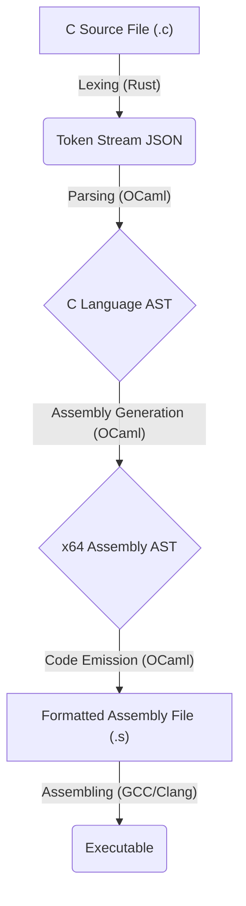

# obvcc

### The obvious minimal C compiler.

A lexer, parser, assembly generator and a code emitter for a multi-language, multi-stage compiler that transforms a minimal C-like language into platform-aware x64 assembly.

[](https://opensource.org/licenses/MIT)
[](https://ocaml.org/)
[](https://www.rust-lang.org/)
[](https://dune.build/)
[](https://crates.io/)
[](https://kernel.org/)
[](https://www.apple.com/macos/)
[](https://gitpod.io/#https://github.com/0bVdnt/obvcc.git)

This project demonstrates tokenization of a c program, parsing of tokens, assembly generation and x64 assembly code emission, which is a part of a full compiler pipeline, starting from a C source file and ending with a runnable assembly file. It is composed of two main repositories working in concert:

1.  **obvcc-lexer (Rust):** A lexical analyzer (lexer or tokenizer) for a simplified C-like programming language, implemented in Rust. It reads source code from a file (or a default string) and produces a stream of tokens, which are output as a JSON array to standard output. If errors are encountered during lexing, a JSON object describing the error is produced.
2.  **obvcc-toolchain (OCaml):** This repository consumes the lexer's output and performs all subsequent stages: parsing, semantic analysis, and assembly code generation.

The primary goal is to build and understand a complete, working toolchain, leveraging the strengths of both Rust (for performance-critical I/O) and OCaml (for its powerful type system and elegance in Abstract Syntax Tree transformations).

---

## 📜 Table of Contents

- [The Compiler Pipeline](#the-compiler-pipeline)
- [The Compilation Stages](#the-compilation-stages)
  - [Stage 1: Lexical Analysis (in Rust)](#stage-1-lexical-analysis-in-rust)
  - [Stage 2: Syntactic Analysis (Parsing in OCaml)](#stage-2-syntactic-analysis-parsing-in-ocaml)
  - [Stage 3: Assembly Generation (in OCaml)](#stage-3-assembly-generation-in-ocaml)
  - [Stage 4: Code Emission (in OCaml)](#stage-4-code-emission-in-ocaml)
- [Current Compiler Capabilities](#current-compiler-capabilities)
- [Project Architecture](#project-architecture)
- [Getting Started](#getting-started)
  - [Prerequisites](#prerequisites)
  - [Installation & Building](#installation--building)
  - [Execution](#execution)
- [Error Handling](#error-handling)
- [Potential Extensions](#potential-extensions)
- [License](#license)

---

## The Compiler Pipeline

This project implements a classic sequential pipeline, where the output of each stage becomes the input for the next, transforming the code from a high-level language into low-level machine instructions.



---

## The Compilation Stages

Each stage performs a distinct transformation on the program's representation.

### Stage 1: Lexical Analysis (in Rust)

The process begins with the **obvcc-lexer** Its job is to scan the raw source text and break it into a stream of atomic units called **tokens**.

- **Input:** C source code (e.g., `int main() { ... }`).
- **Process:** Identifies keywords (`int`), identifiers (`main`), punctuation (`{`, `}`), and literals (`42`).
- **Output:** A JSON array of these tokens, ready for the next stage.

#### Features

- **Tokenizes basic C-like constructs:**
  - Keywords: `int`, `void`, `return`
  - Identifiers: (e.g., `main`, `variableName`, `_foo123`)
  - Integer Constants: (e.g., `0`, `123`, `42`)
  - Punctuation: `(`, `)`, `{`, `}`, `;`
- **Skips Whitespace:** Ignores spaces, tabs, and newlines between tokens.
- **Handles Comments:**
  - Single-line comments: `// ... until end of line`
  - Multi-line comments: `/* ... can span multiple lines ... */` (non-nested)
- **Error Reporting:** Produces structured JSON output for lexical errors, including:
  - `UnexpectedCharacter`: When a character is found that cannot start any known token.
  - `InvalidInteger`: When a numeric literal is malformed or out of range (for `i32`).
  - `NoMatch`: A fallback for when no token rule applies at a position.
- **JSON Output:** Outputs the token stream or error information in JSON format for easy interoperability with other tools or compiler stages written in different languages.
- **Modular Design:** The lexer logic is organized into sub-modules for clarity:

  - `token.rs`: Defines the `Token` enum.
  - `error.rs`: Defines the `LexerError` enum.
  - `core.rs`: Contains the `Lexer` struct and core tokenization logic.
  - `mod.rs`: Aggregates the lexer module and provides its public API.

### Stage 2: Syntactic Analysis (Parsing in OCaml)

The **parser** gives structure to the flat stream of tokens. It verifies that the tokens conform to the language's formal grammar and builds a hierarchical representation of the code.

#### Core Parsing Concepts

The parser's primary responsibilities are:

- **Input:** To consume a linear sequence of tokens produced by the lexer.
- **Syntactic Analysis:** To verify that this sequence of tokens conforms to the formal grammar of the source language. If it does not, the parser reports a **syntax error**.
- **Output:** To produce a tree-like data structure called an **Abstract Syntax Tree (AST)** that represents the hierarchical structure and meaning of the source code.

This project implements a **recursive descent parser**, which is a top-down parsing strategy. The core idea is to create a set of mutually recursive functions, where each function is responsible for parsing one non-terminal symbol from the language's grammar. This approach makes the parser code a direct, readable reflection of the formal grammar.

#### From Grammar to Code: The Three Artifacts

The construction of this parser relies on three distinct but related artifacts:

**1. The AST Definition (ASDL)**

The Abstract Syntax Tree (AST) is the **output** of the parser. It's a hierarchical representation of the program's meaning, stripped of syntactic details like semicolons and braces.

> _ASDL for this project:_
>
> ```asdl
> program = Program(function_definition)
> function_definition = Function(identifier name, statement body)
> statement = Return(exp)
> exp = Constant(int)
> ```
>
> In our OCaml project, this is implemented using algebraic data types in `lib/ast.ml`.

**2. The Formal Grammar (EBNF)**

The formal grammar defines the **concrete syntax** of the language. It guides the parser's logic by specifying exactly which tokens are required and in what order.

> _EBNF for this project:_
>
> ```ebnf
> <program>   ::= <function>
> <function>  ::= "int" <identifier> "(" [ "void" ] ")" "{" <statement> "}"
> <statement> ::= "return" <exp> ";"
> <exp>       ::= <integer_literal>
> ```

**3. The Parser Implementation**

The parser's code is the bridge between the formal grammar and the AST. It consumes tokens according to the grammar rules and constructs the corresponding AST nodes.

> _Pseudocode for `parse_statement`:_
>
> ```pseudocode
> parse_statement(tokens):
>     expect("return", tokens)      // Consume a terminal from the grammar
>     return_val = parse_exp(tokens)  // Call a function for a non-terminal
>     expect(";", tokens)          // Consume another terminal
>     return Return(return_val)    // Construct and return an AST node
> ```

### Stage 3: Assembly Generation (in OCaml)

This is the first step of translation towards the target machine. The **assembly generator** walks the high-level C AST and translates it into a lower-level, structured representation of assembly code.

#### From C AST to Assembly AST

This stage is another transformation from one tree structure to another. It is defined by two key artifacts: the target Assembly AST and the translation logic.

**1. The Assembly AST Definition (ASDL)**

This defines the structure of our assembly language representation. Keeping assembly in this structured form (instead of printing strings directly) allows for easier manipulation and platform-specific logic.

> _ASDL for the Assembly AST:_
>
> ```asdl
> program = Program(function_definition)
> function_definition = Function(identifier name, instruction* instructions)
> instruction = Mov(operand src, operand dst) | Ret
> operand = Imm(int) | Register
> ```
>
> In our OCaml project, this is implemented in `lib/assembly_ast.ml`.

**2. The Translation Logic**

The `assembly_generator.ml` module contains the functions that traverse the C AST and build the Assembly AST. A key concept is that a single, high-level C node may expand into multiple low-level assembly instructions.

> _Example Translation:_
> A `Return` node from the C AST...
>
> ```ocaml
> (* C AST Node *)
> S_Return (E_Constant 42)
> ```
>
> ...is translated into a _list_ of assembly instructions:
>
> ```ocaml
> (* Assembly AST Nodes *)
> [ I_Mov (A_Imm 42, A_Register); I_Ret ]
> ```
>
> This corresponds to `movl $42, %eax` followed by `ret`.

### Stage 4: Code Emission (in OCaml)

The **code emitter** performs the final translation. It traverses the structured Assembly AST and prints the final, formatted text.

- **Input:** The Assembly AST.
- **Process:** Each node of the Assembly AST is converted into its textual x64 assembly equivalent. This stage handles platform-specific syntax like `_main` for macOS and `.note.GNU-stack` for Linux.
- **Output:** A complete, formatted assembly file (`.s`) ready to be assembled.

---

## Current Compiler Capabilities

The compiler can successfully process programs that have the following structure:

- A single `int` function with an identifier (e.g., `main`).
- The function's parameter list can be `()` or `(void)`.
- The function body must contain exactly one `return` statement.
- The `return` statement must return a single integer literal.

#### Valid Code Example:

```c
int main(void) {
    return 42;
}
```

The output for this code will be a runnable assembly file that, when executed, produces an exit code of `42`.

---

## Project Architecture

This Rust + OCaml project is structured as a directory which contains two seperate directories (`obvcc-lexer` and `obvcc-toolchain`). The `obvcc-lexer` directory contains rust lexer which uses `Cargo` as the package manager and build system and the `obvcc-toolchain` directory contains the ocaml toolchain which used the Dune build system.

```
obvcc/
├── obvcc-lexer/
│   ├── Cargo.toml                 # Rust project configuration, dependencies
│   ├── src/                       # Source code directory
│   │   ├── main.rs                # Application entry point, handles I/O and orchestrates the lexer
│   │   └── lexer/                 # Lexer module directory
│   │       ├── mod.rs             # Lexer module entry point, re-exports public items, tests
│   │       ├── token.rs           # Token enum definition
│   │       ├── error.rs           # LexerError enum definition
│   │       └── core.rs            # Lexer struct and core tokenization logic
│   └── target/                    # Build artifacts (generated by `cargo build`)
└── obvcc-toolchain/
    ├── bin/                       # Executable code
    │   ├── dune
    │   └── main.ml                # Entry point: orchestrates the full pipeline
    ├── lib/                       # Library code (reusable)
    │   ├── ast.ml                 # Defines C AST, token types, and exceptions
    │   ├── ast.mli                # Public interface for the Ast module
    │   ├── assembly_ast.ml        # Defines the x64 Assembly AST types
    │   ├── assembly_generator.ml  # Logic to convert C AST -> Assembly AST
    │   ├── code_emitter.ml        # Logic to convert Assembly AST -> Assembly String
    │   ├── dune
    │   ├── parser.ml              # The recursive descent parsing logic
    │   ├── parser.mli             # Public interface for the Parser
    │   ├── token_stream.ml        # Deserializes JSON into a token list
    │   └── token_stream.mli       # Public interface for the Token_stream
    ├── dune-project
    └── obvcc_toolchain.opam       # Project metadata and dependencies
```

---

## Getting Started

### Prerequisites

- [Rust and Cargo](https://rustup.rs/) (for the lexer).
- [OCaml (version 5.0+) and OPAM](https://ocaml.org/install) (the OCaml Package Manager).
- The [Dune build system](https://dune.build/).
- A C compiler like `gcc` or `clang` (for assembling the final output).

### Installation & Building

1.  **Clone this repository:**

    ```bash
    git clone https://github.com/0bVdnt/obvcc.git
    cd obvcc
    ```

2.  **Build the Rust Lexer:**

    ```bash
    cd obvcc-lexer
    cargo build --release
    cd ..
    ```

    This command will create a `obvcc-lexer` executable in the `target/release` directory

3.  **Install OCaml Dependencies and Build the Compiler:**

    ```bash
    cd obvcc-toolchain
    opam install dune yojson
    dune build
    ```

    This command will create the `main.exe` executable inside the `_build` directory.

### Execution

The full pipeline involves two main steps: running the lexer, then running the OCaml toolchain on its output.

1.  **Run Lexer:** Create a source file `test.c` and run the lexer, saving the output to a JSON file.

    ```bash
    # From the parent directory of both repos
    ./obvcc-lexer/target/release/obvcc-lexer ./obvcc-toolchain/test.c > ./obvcc-toolchain/test.json
    ```

2.  **Run OCaml Compiler:** Navigate into the `obvcc-toolchain` repo and run the executable on the generated JSON file.

    ```bash
    cd obvcc-toolchain
    dune exec -- ./bin/main.exe test.json
    ```

    This will generate a `test.s` assembly file.

3.  **Assemble and Run:** Use `gcc` or `clang` to create a final executable from the assembly file.
    ```bash
    gcc -o test_executable test.s
    ./test_executable
    echo $?  # Should print the value from your return statement
    ```

---

## Error Handling

The compiler is designed to fail gracefully at each stage:

- **Lexer:** Reports errors if the source code contains invalid characters.
- **Parser:**
  - Raises a `DeserializationError` if the input is not valid JSON or if the lexer reported an error.
  - Raises a `SyntaxError` if the token stream violates the language grammar.
- All errors are printed to standard error (`stderr`), and the program terminates with a non-zero exit code.

---

## Potential Extensions

This compiler is a solid foundation that can be extended to support a more complex language. Future work could include:

- Parsing and generating code for complex expressions (binary/unary operators).
- Adding support for variables, scope, and assignment.
- Implementing control flow statements like `if`/`else` and loops.
- Parsing function arguments and multiple functions.

---

## License

This project is licensed under the **MIT License**.
